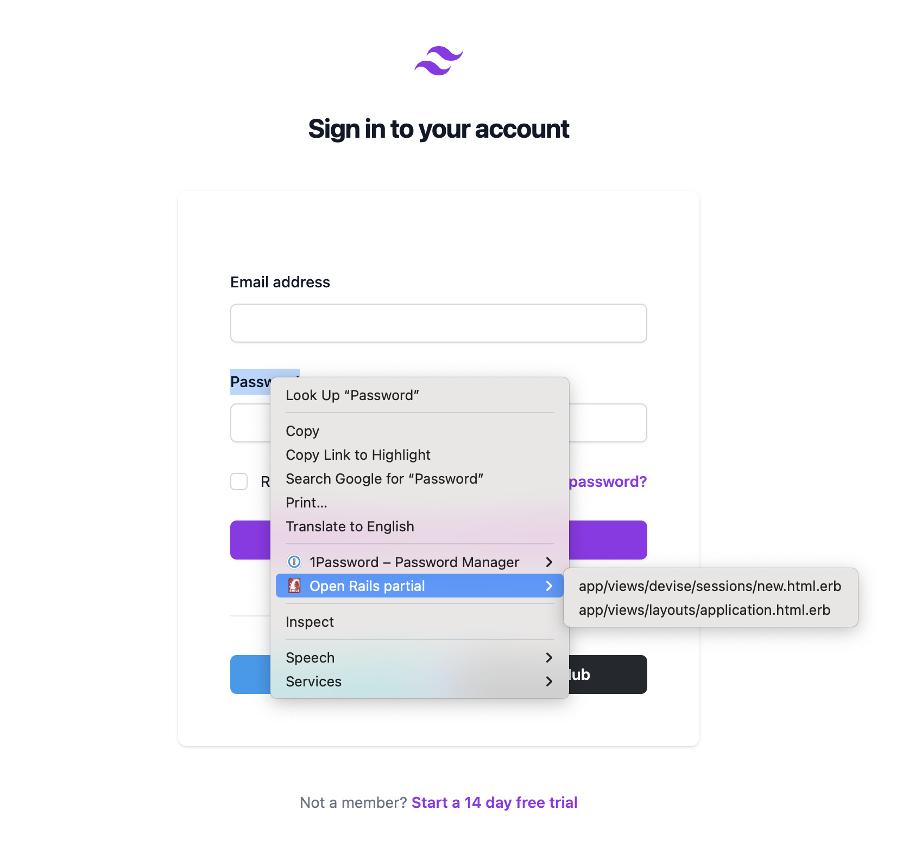

# Rails Open Partial Chrome Extension


Open your Rails partials in your editor from the browser.



## Setup

```
npm install
```

## Build

```
npm run build
```

## Build in watch mode

### terminal

```
npm run watch
```

### Visual Studio Code

Run watch mode.

type `Ctrl + Shift + B`

## Load extension to chrome

Load `dist` directory

## Test
`npx jest` or `npm run test`
